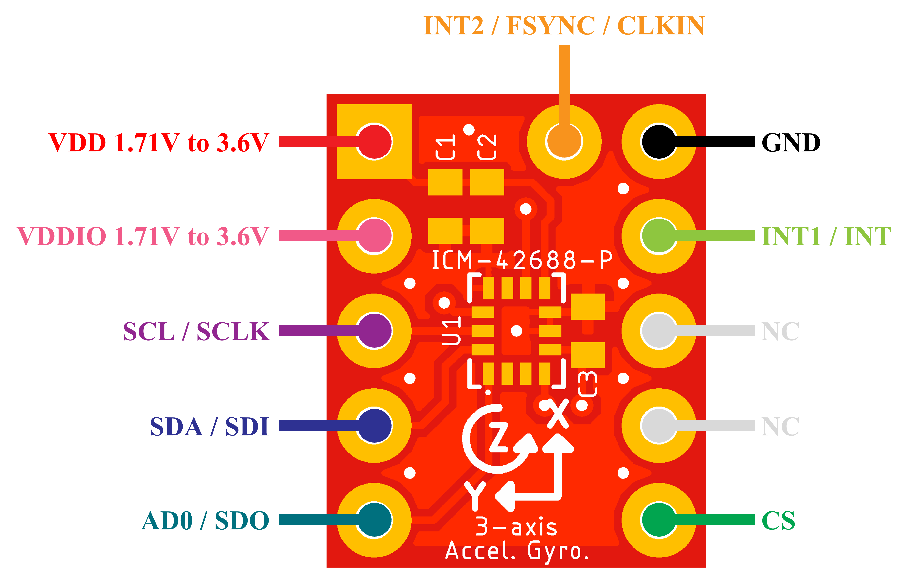

<html lang="en">
  <head>
    <meta charset="uft-8">
    <meta name="author" content="Masato Kubotera">
  </head>
  <body>
    <strong>This product is currently under development and has not been tested.</strong>
    <h1>ICM-42688-P-Module</h1>
    <h2>About ICM-42688-P-Module</h2>
    

      ICM-42688-P-Module is a module of 6-axis acceleration/gyro sensor "<a href="https://product.tdk.com/en/search/sensor/mortion-inertial/imu/info?part_no=ICM-42688-P">ICM-42688-P</a>" made by TDK.
    

    <h2>Features of Ver. 1.0</h2>
    <h3>PCB</h3>
        <ul>
            <li>4" x 5" (10.16 mm x 12.70 mm) PCB layout</li>
            <li>2 x 5-pin + 1-pin 0.1" spaced PTH
                <ul>
                    <li><strong>VDD</strong> : Power supply voltage</li>
                    <li><strong>VDDIO</strong> : IO power supply voltage</li>
                    <li><strong>SCL / SCLK</strong> : I2C serial clock / AP SPI serial clock</li>
                    <li><strong>SDA / SDI</strong> :  I2C serial data / SPI serial data input (4-wire mode)</li>
                    <li><strong>AD0 / SDO</strong> :  I2C slave address LSB / SPI serial data output (4-wire mode)</li>
                    <li><strong>CS</strong> : SPI Chip select (Connect to VDDIO if using I2C interface)</li>
                    <li><strong>INT1 / INT</strong> : Interrupt 1 / All interrupts mapped to pin 4</li>
                    <li><strong>INT2 / FSYNC / CLKIN</strong> : Interrupt 2 / Frame sync input / External clock input</li>
                    <li><strong>GND</strong> : Common Ground</li>
                    <li><strong>NC</strong> : Non Connection</li>
                </ul>
            </li>
        </ul>
        
    <h3><a href="https://product.tdk.com/en/search/sensor/mortion-inertial/imu/info?part_no=ICM-42688-P">ICM-42688-P</a></h3>
        <ul>
            <li>Input Voltage Range: 1.71V to 3.6V</li>
            <li>Digital-output X-, Y-, and Z-axis angular rate sensors (gyroscopes) with programmable full-scale range of ±15.625, ±31.25,±62.5, ±125, ±250, ±500, ±1000, and ±2000 degrees/sec</li>
            <li>Digital-output X-, Y-, and Z-axis accelerometer with programmable full-scale range of ±2g, ±4g ±8g and ±16g</li>
            <li>The host interface can be configured to support I3CSM slave, I2C slave, or SPI slave modes. The I3CSM interface supports speeds up to 12.5MHz (data rates up to 12.5Mbps in SDR mode, 25Mbps in DDR mode), the I2C interface supports speeds up to 1 MHz, and the SPI interface supports speeds up to 24 MHz.</li>
            <li>Digital-output temperature sensor</li>
            <li>I2C Address: 0x68 (AD0=0), 0x69 (AD0=1)</li>
        </ul>
    <h2>Repository Contents</h2>
        

        <dl>
            <dt>
                <a href="/images">\images</a>
            </dt>
            <dd>PCB preview images and capture of design screen</dd>
            <dt>
                <a href="/libraries">\libraries</a>
            </dt>
            <dd>Libraries used in Autodesk Eagle design</dd>
            <dt>
                <a href="/Schematic.pdf">Schematic.pdf</a>
            </dt>
            <dd>Circuit diagram of the product</dd>
            <dt>
                <a href="/BOM.txt">BOM.txt</a>
            </dt>
            <dd>Parts lists output from design file</dd>
            <dt>*.brd</dt>
            <dd>Board wiring design file by Autodesk Eagle</dd>
            <dt>*.sch</dt>
            <dd>Circuit diagram design file by Autodesk Eagle</dd>
            <dt>
                <a href="/Gerber_data.zip">\Gerber_data.zip</a>
            </dt>
            <dd>Zip folder of Gerber format files for PCB manufacturing</dd>
            <dt>
                <a href="/LICENSE">LICENSE</a>
            </dt>
            <dd>License to use the product</dd>
            <dt>
                <a href="/.gitignore">.gitignore</a>
            </dt>
            <dd>File to exclude cache files from management</dd>
        </dl>
    

    <h2>Documentation</h2>
      

        <h3>BOM</h3>
          <table>
            <thead>
              <tr>
                <th> Eagle Design Parts # </th>
                <th> Q'ty </th>
                <th> Mfr. Product # </th>
                <th> Supplier </th>
                <th> Description </th>
              </tr>
            </thead>
            <tbody>
              <tr>
                <td>U1</td>
                <td>1</td>
                <td>ICM-42688-P</td>
                <td><a href="https://www.mouser.jp/ProductDetail/410-ICM-42688-P">Mouser</a></td>
                <td>Inertial Measurement Units 6-axis</td>
              </tr>
              <tr>
                <td>C1</td>
                <td>1</td>
                <td>GRM155R71C104JA88D</td>
                <td><a href="https://www.mouser.jp/ProductDetail/81-GRM155R71C104JA8D">Mouser</a></td>
                <td>Multilayer Ceramic Capacitor SMD 0.1uF 16V 5% X7R 0402</td>
              </tr>
              <tr>
                <td>C2</td>
                <td>1</td>
                <td>GRM155Z71A225KE01D</td>
                <td><a href="https://www.mouser.jp/ProductDetail/81-GRM155Z71A225KE1D">Mouser</a></td>
                <td>Multilayer Ceramic Capacitor SMD 2.2uF 10V 10% X7R 0402</td>
              </tr>
              <tr>
                <td>C3</td>
                <td>1</td>
                <td>GRM155R71E103KA01D</td>
                <td><a href="https://www.mouser.jp/ProductDetail/81-GRM36X103K25">Mouser</a></td>
                <td>Multilayer Ceramic Capacitor SMD 10nF 25V 10% X7R 0402</td>
              </tr>
            </tbody>
          </table>
          Exterior components were determined with reference to <a href="https://product.tdk.com/system/files/dam/doc/product/sensor/mortion-inertial/imu/data_sheet/ds-000347-icm-42688-p-v1.6.pdf#page=22">ICM-42688-P Datasheet</a>.
      

    <h2>Confirmation of operation</h2>
    

      The following Arduino Library https://github.com/finani/ICM42688 was used to verify the operation.       
      The Arduino Board used is "<a href="https://docs.arduino.cc/hardware/due">Arduino Due</a>". 
      Up to 3.6V is the supply voltage for VDD and VDDIO of this module. 
      <ul>
        <li><strong>SPI</strong> : https://github.com/finani/ICM42688/tree/master/examples/Basic_SPI</li>
        Wiring with Arudino Due is done as follows.
        <table>
            <thead>
              <tr>
                <th> ICM-42688-P Module Pin </th>
                <th> Arudiono Board Pin </th>
              </tr>
            </thead>
            <tbody>
              <tr>
                <td>VDD</td>
                <td>3.3V</td>
              </tr>
              <tr>
                <td>VDDIO</td>
                <td>3.3V</td>
              </tr>
              <tr>
                <td>SCL/SCLK</td>
                <td>SCK</td>
              </tr>
              <tr>
                <td>SDA _SDI</td>
                <td>MOSI</td>
              </tr>
              <tr>
                <td>AD0/SD0</td>
                <td>MISO</td>
              </tr>
              <tr>
                <td>CS</td>
                <td>Any GPIO (In the case of the sample sketch, digital pin 10 of arduino due board is used .)</td>
              </tr>
              <tr>
                <td>INT1/INT</td>
                <td>-</td>
              </tr>
              <tr>
                <td>GND</td>
                <td>GND</td>
              </tr>
              <tr>
                <td>INT2/FSYNC/CLKIN</td>
                <td>-</td>
              </tr>
            </tbody>
          </table>
        <li><strong>I2C</strong> : https://github.com/finani/ICM42688/blob/master/examples/Basic_I2C/Basic_I2C.ino</li>
        4.7 kOhm resistors should be used as pullups on SDA and SCL, these resistors should pullup with a 3.3V source. 
        Wiring with Arudino Due is done as follows.
        <table>
            <thead>
              <tr>
                <th> ICM-42688-P Module Pin </th>
                <th> Arudiono Board Pin </th>
              </tr>
            </thead>
            <tbody>
              <tr>
                <td>VDD</td>
                <td>3.3V</td>
              </tr>
              <tr>
                <td>VDDIO</td>
                <td>3.3V</td>
              </tr>
              <tr>
                <td>SCL/SCLK</td>
                <td>SCL (digital pin 21 of arduino due board)</td>
              </tr>
              <tr>
                <td>SDA _SDI</td>
                <td>SDA (digital pin 20 of arduino due board)</td>
              </tr>
              <tr>
                <td>AD0/SD0</td>
                <td>GND for I2C address 0x68 or 3.3V for I2C address 0x69</td>
              </tr>
              <tr>
                <td>CS</td>
                <td>-</td>
              </tr>
              <tr>
                <td>INT1/INT</td>
                <td>-</td>
              </tr>
              <tr>
                <td>GND</td>
                <td>GND</td>
              </tr>
              <tr>
                <td>INT2/FSYNC/CLKIN</td>
                <td>-</td>
              </tr>
            </tbody>
          </table>
      </ul>  
    

    <h2>Contact</h2>
    

    If you have any questions, please contact MasatoKubotera, the product's designer, by E-mail. 
    E-mail : <a href="mailto:masatokubotera06@yahoo.co.jp">masatokubotera06@yahoo.co.jp</a>
    

    <h2>License Information</h2>
    

      This product is open source. 
      Please review the <a href="/LICENSE">LICENSE file</a> for license information. 
       
      <strong>ICM-42688-P-Module</strong> by Masato Kubotera is licensed under a <a href="http://creativecommons.org/licenses/by-nc-sa/4.0/">Creative Commons Attribution-NonCommercial-ShareAlike 4.0 International License</a>.
    
    
  </body>
</html>
